<h1>
  
</h1>

[](https://www.nextflow.io/)
[](https://docs.conda.io/en/latest/)
[](https://www.docker.com/)
[](https://sylabs.io/docs/)

## Introduction

**miRdeX-nf** is a Nextflow-based pipeline for differential expression analysis of microRNAs (miRNAs) from small RNA sequencing (sRNA-seq) data. One of the key features of miRdeX-nf is its ability to process and analyze data from multiple comparisons, projects, or species simultaneously. Users only need to include the data for the projects they wish to analyze, and the pipeline will return results for all of them in a single run.



> This metro map was inspired by the workflow representation style used in the [nf-core/rnaseq](https://github.com/nf-core/rnaseq/tree/master) documentation. In case the image above is not loading, please have a look at the [static version](docs/mirdex_metromap_static.svg).

1. SRA download (`prefetch` and `fasterq-dump`)
2. Support for direct input: FASTQ or precomputed count matrices
3. Read preprocessing (FASTQ):
   - Adapter and quality trimming (`fastp`)
   - Quality control (`FastQC`, `MultiQC`)
   - Filtering against user-provided reference FASTA (`Bowtie`)
   - Genome alignment with user-supplied genome (`Bowtie`)
4. Validation of sequencing depth for each library and minimum number of biological replicates per condition.
5. Small RNA quantification:
   - Raw counts of small RNAs
   - Generation of raw count matrices
6. Exploratory and differential expression analysis:
   - Low-count filtering
   - Principal Component Analysis (PCA)
   - `DESeq2`
7. miRNA annotation and isomiR classification:
   - Initial alignment of sRNA sequences to reference mature and precursor miRNAs from `miRBase`, `sRNAanno` or `PmiREN` databases (`BLASTn`)
   - Classification of aligned sequences into:
     - Canonical miRNAs (perfect match to mature sequence)
     - Templated isomiRs (sequence variants that align perfectly with the precursor)
     - Non-templated isomiRs (variants with mismatches or additions not present in the precursor)
   - Re-alignment of non-templated sequences to the user-provided genome to discard perfect matches elsewhere (potential false positives) (`Bowtie`)
   - Abundance filtering based on minimum Reads Per Million (RPM) or relative abundance compared to the canonical miRNA:
     - Sequences passing the threshold are labeled as `PASS`
     - Sequences below threshold are labeled as `REJECT`
   - Final classification of detected isomiRs
   - Annotation of differentially expressed sRNAs to identify those corresponding to miRNAs or isomiRs
8. Global patterns of DE miRNAs
   - Generation of binary matrices indicating which miRNAs are differentially expressed across the analyzed conditions
   - Creation of log₂ fold-change matrices showing the direction and magnitude of expression changes
   - Summary provided at both individual miRNA and miRNA family levels
   - Designed to support global analysis and identification of shared or condition-specific expression patterns

## Usage

To run **miRdeX-nf**, you must provide a properly formatted samplesheet specifying the inputs and metadata for each analysis. The pipeline supports multiple input types, including FASTQ files, SRA accession lists, and raw count matrices. Only the FASTQ input format is shown below; for full details on all supported input types, see the [usage documentation](docs/usage.md).

**samplesheet.tsv**:

```tsv
Id       File                    Metadata                   Genome             Group
sample1  data/sample1.fastq.gz   metadata/PROJECT1_meta.tsv genomes/ath.fa    
sample2  data/sample2.fastq.gz   metadata/PROJECT1_meta.tsv genomes/ath.fa    
sample3  data/sample3.fastq.gz   metadata/PROJECT1_meta.tsv genomes/ath.fa    
sample4  data/sample4.fastq.gz   metadata/PROJECT1_meta.tsv genomes/ath.fa    
sample5  data/sample5.fastq.gz   metadata/PROJECT1_meta.tsv genomes/ath.fa    
sample6  data/sample6.fastq.gz   metadata/PROJECT1_meta.tsv genomes/ath.fa    
```

In this example, each row represents a single-end FASTQ file associated with a sample to be analyzed. On the other hand, the columns represent:

- **Id**: FASTQ file identifier. It represents the sample ID and must match the Run column in the metadata file.
- **File**: Path to the input FASTQ file.
- **Metadata**: Path to a metadata file describing the experimental design (e.g., sample conditions, replicates).
- **Genome** *(optional)*: Path to a reference genome FASTA file. Required if genome-based filtering or isomiR annotation is enabled.
- **Group** *(optional)*: Used when input is a count matrix. Not required when using FASTQ files.

The pipeline can be executed as follows:
```
nextflow run miRdeX-nf/main.nf
   --input <SAMPLESHEET>
   --outdir <OUTDIR>
   -profile <docker/singularity/.../>
```
> [!NOTE] 
> For a detailed explanation of how to prepare each input type, as well as additional details and functionality, please refer to the [usage documentation](docs/usage.md) and the [parameter documentation](docs/parameters.md).


## Pipeline output

The pipeline produces a structured set of results, including processed libraries, quality control reports, quantification tables, differential expression results, and miRNA/isomiR annotations. For a **comprehensive description of the generated outputs and accompanying reports**, please refer to the [output documentation](docs/OUTPUT.md).

## Credits

We gratefully acknowledge the [nf-core](https://nf-co.re) community, whose work has established the benchmark for robust, reproducible, and well-documented bioinformatics workflows. Their open sharing of knowledge and best practices has been an essential reference throughout the development of miRdeX-nf.

We would also like to express our gratitude to members of the [ncRNAlab](https://www.ncrnalab.com), whose ideas, feedback, and support have contributed in different ways to the creation of this pipeline. Their involvement has been invaluable for shaping miRdeX-nf into its current form.

- [Julia Corell](https://github.com/jucosie)
- [Marta Núñez](https://github.com/marnuesa)
- [Pascual Villalba](https://github.com/pasviber)
 
## Citation

If you use mirDeX-nf in your research, please cite it with the following DOI: [placeholder DOI]

All software and tool references for this pipeline are provided in the [citations.md](docs/citations.md) file.
